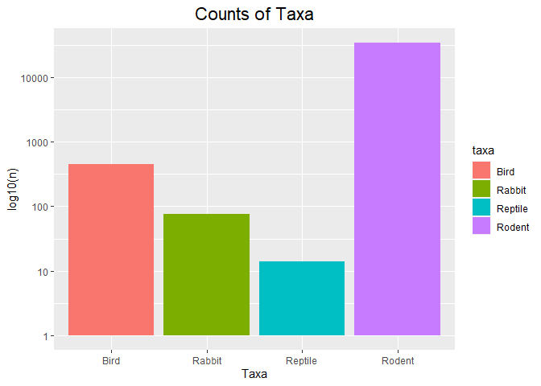
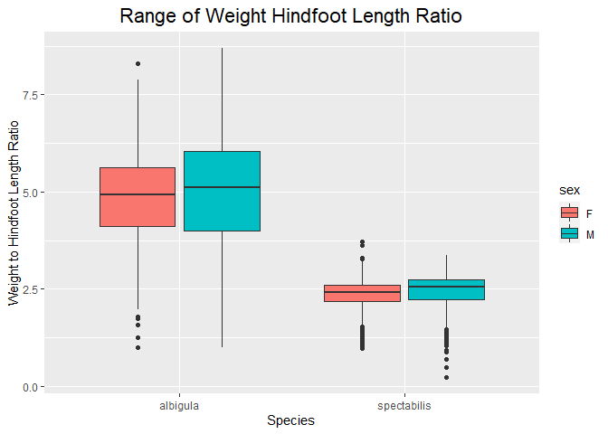
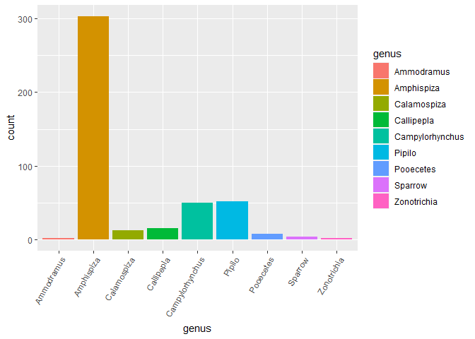

## Instructions
Answer the following questions and complete the exercises in RMarkdown. Please embed all of your code and push your final work to your repository. Your final lab report should be organized, clean, and run free from errors. Remember, you must remove the `#` for the included code chunks to run. Be sure to add your name to the author header above. For any included plots, make sure they are clearly labeled. You are free to use any plot type that you feel best communicates the results of your analysis.  

Make sure to use the formatting conventions of RMarkdown to make your report neat and clean!  

## Load the libraries

```r
library(tidyverse)
library(janitor)
library(here)
library(naniar)
library(skimr)
```

## Desert Ecology
For this assignment, we are going to use a modified data set on [desert ecology](http://esapubs.org/archive/ecol/E090/118/). The data are from: S. K. Morgan Ernest, Thomas J. Valone, and James H. Brown. 2009. Long-term monitoring and experimental manipulation of a Chihuahuan Desert ecosystem near Portal, Arizona, USA. Ecology 90:1708.

```r
deserts <- read_csv(here("lab10", "data", "surveys_complete.csv"))
```

```
## 
## ── Column specification ────────────────────────────────────────────────────────
## cols(
##   record_id = col_double(),
##   month = col_double(),
##   day = col_double(),
##   year = col_double(),
##   plot_id = col_double(),
##   species_id = col_character(),
##   sex = col_character(),
##   hindfoot_length = col_double(),
##   weight = col_double(),
##   genus = col_character(),
##   species = col_character(),
##   taxa = col_character(),
##   plot_type = col_character()
## )
```

1. Use the function(s) of your choice to get an idea of its structure, including how NA's are treated. Are the data tidy?  

```r
skim(deserts)
```


Table: Data summary

|                         |        |
|:------------------------|:-------|
|Name                     |deserts |
|Number of rows           |34786   |
|Number of columns        |13      |
|_______________________  |        |
|Column type frequency:   |        |
|character                |6       |
|numeric                  |7       |
|________________________ |        |
|Group variables          |None    |


**Variable type: character**

|skim_variable | n_missing| complete_rate| min| max| empty| n_unique| whitespace|
|:-------------|---------:|-------------:|---:|---:|-----:|--------:|----------:|
|species_id    |         0|          1.00|   2|   2|     0|       48|          0|
|sex           |      1748|          0.95|   1|   1|     0|        2|          0|
|genus         |         0|          1.00|   6|  16|     0|       26|          0|
|species       |         0|          1.00|   3|  15|     0|       40|          0|
|taxa          |         0|          1.00|   4|   7|     0|        4|          0|
|plot_type     |         0|          1.00|   7|  25|     0|        5|          0|


**Variable type: numeric**

|skim_variable   | n_missing| complete_rate|     mean|       sd|   p0|     p25|     p50|      p75|  p100|hist  |
|:---------------|---------:|-------------:|--------:|--------:|----:|-------:|-------:|--------:|-----:|:-----|
|record_id       |         0|          1.00| 17804.20| 10229.68|    1| 8964.25| 17761.5| 26654.75| 35548|▇▇▇▇▇ |
|month           |         0|          1.00|     6.47|     3.40|    1|    4.00|     6.0|    10.00|    12|▇▆▆▅▇ |
|day             |         0|          1.00|    16.10|     8.25|    1|    9.00|    16.0|    23.00|    31|▆▇▇▇▆ |
|year            |         0|          1.00|  1990.50|     7.47| 1977| 1984.00|  1990.0|  1997.00|  2002|▇▆▇▇▇ |
|plot_id         |         0|          1.00|    11.34|     6.79|    1|    5.00|    11.0|    17.00|    24|▇▆▇▆▅ |
|hindfoot_length |      3348|          0.90|    29.29|     9.56|    2|   21.00|    32.0|    36.00|    70|▁▇▇▁▁ |
|weight          |      2503|          0.93|    42.67|    36.63|    4|   20.00|    37.0|    48.00|   280|▇▁▁▁▁ |

```r
glimpse(deserts)
```

```
## Rows: 34,786
## Columns: 13
## $ record_id       <dbl> 1, 2, 3, 4, 5, 6, 7, 8, 9, 10, 11, 12, 13, 14, 15, 16…
## $ month           <dbl> 7, 7, 7, 7, 7, 7, 7, 7, 7, 7, 7, 7, 7, 7, 7, 7, 7, 7,…
## $ day             <dbl> 16, 16, 16, 16, 16, 16, 16, 16, 16, 16, 16, 16, 16, 1…
## $ year            <dbl> 1977, 1977, 1977, 1977, 1977, 1977, 1977, 1977, 1977,…
## $ plot_id         <dbl> 2, 3, 2, 7, 3, 1, 2, 1, 1, 6, 5, 7, 3, 8, 6, 4, 3, 2,…
## $ species_id      <chr> "NL", "NL", "DM", "DM", "DM", "PF", "PE", "DM", "DM",…
## $ sex             <chr> "M", "M", "F", "M", "M", "M", "F", "M", "F", "F", "F"…
## $ hindfoot_length <dbl> 32, 33, 37, 36, 35, 14, NA, 37, 34, 20, 53, 38, 35, N…
## $ weight          <dbl> NA, NA, NA, NA, NA, NA, NA, NA, NA, NA, NA, NA, NA, N…
## $ genus           <chr> "Neotoma", "Neotoma", "Dipodomys", "Dipodomys", "Dipo…
## $ species         <chr> "albigula", "albigula", "merriami", "merriami", "merr…
## $ taxa            <chr> "Rodent", "Rodent", "Rodent", "Rodent", "Rodent", "Ro…
## $ plot_type       <chr> "Control", "Long-term Krat Exclosure", "Control", "Ro…
```

```r
deserts %>% 
  summarize(num_nas = sum(is.na(deserts)))
```

```
## # A tibble: 1 x 1
##   num_nas
##     <int>
## 1    7599
```


2. How many genera and species are represented in the data? What are the total number of observations? Which species is most/ least frequently sampled in the study?

```r
deserts %>% 
  summarize(num_genera = n_distinct(genus), num_species = n_distinct(species), tot_observations = n())
```

```
## # A tibble: 1 x 3
##   num_genera num_species tot_observations
##        <int>       <int>            <int>
## 1         26          40            34786
```

```r
deserts_species_counts <- deserts %>% 
  count(species)
deserts_species_counts %>% 
  filter(n == max(deserts_species_counts$n) | n == min(deserts_species_counts$n)) %>% 
  arrange(desc(n))
```

```
## # A tibble: 7 x 2
##   species          n
##   <chr>        <int>
## 1 merriami     10596
## 2 clarki           1
## 3 scutalatus       1
## 4 tereticaudus     1
## 5 tigris           1
## 6 uniparens        1
## 7 viridis          1
```

3. What is the proportion of taxa included in this study? Show a table and plot that reflects this count.

```r
deserts %>% 
  count(taxa)
```

```
## # A tibble: 4 x 2
##   taxa        n
##   <chr>   <int>
## 1 Bird      450
## 2 Rabbit     75
## 3 Reptile    14
## 4 Rodent  34247
```

```r
deserts %>% 
  ggplot(aes(x = taxa, fill = taxa)) +
  geom_bar() +
  scale_y_log10() +
  labs(title = "Counts of Taxa",
       x = "Taxa",
       y = "log10(n)") +
  theme(plot.title = element_text(size = rel(1.5), hjust = 0.5))
```

<!-- -->


4. For the taxa included in the study, use the fill option to show the proportion of individuals sampled by `plot_type.`

```r
deserts %>% 
  ggplot(aes(x = taxa, fill = plot_type)) +
  geom_bar() +
  coord_flip() +
  scale_y_log10() +
  labs(title = "Counts of Taxa",
       x = "Taxa",
       y = "log10(n)") +
  theme(plot.title = element_text(size = rel(1.5), hjust = 0.5))
```

<!-- -->

5. What is the range of weight for each species included in the study? Remove any observations of weight that are NA so they do not show up in the plot.

```r
deserts %>% 
  filter(!is.na(weight)) %>% 
  ggplot(aes(x = species, y = weight)) +
  geom_boxplot() +
  coord_flip() +
  deserts %>% 
  labs(title = "Weight Ranges by Species",
       x = "Species Name",
       y = "Weight") +
  theme(plot.title = element_text(size = rel(1.5), hjust = 0.5))
```

<!-- -->

6. Add another layer to your answer from #4 using `geom_point` to get an idea of how many measurements were taken for each species.

```r
deserts %>% 
  filter(!is.na(weight)) %>% 
  ggplot(aes(x = species, y = weight)) +
  geom_boxplot() +
  geom_point(size = 0.5)+
  coord_flip() +
  deserts %>% 
  labs(title = "Weight Ranges by Species",
       x = "Species Name",
       y = "Weight") +
  theme(plot.title = element_text(size = rel(1.5), hjust = 0.5))
```

<!-- -->

7. [Dipodomys merriami](https://en.wikipedia.org/wiki/Merriam's_kangaroo_rat) is the most frequently sampled animal in the study. How have the number of observations of this species changed over the years included in the study?

```r
deserts_merriami <- deserts %>% 
  filter(species == "merriami")
```


```r
deserts_merriami %>% 
  ggplot(aes(x = year)) +
  geom_bar() +
  labs(title = "Dipodomys Merriami Sampled by Year",
       x = "Year",
       y = "n") +
  theme(plot.title = element_text(size = rel(1.5), hjust = 0.5))
```

<!-- -->

8. What is the relationship between `weight` and `hindfoot` length? Consider whether or not over plotting is an issue.

This seems to be a good example of over-plotting. 

```r
deserts %>% 
  filter(!is.na(weight) | !is.na(hindfoot_length)) %>% 
  ggplot(aes(x = weight, y = hindfoot_length)) +
  geom_point() +
  labs(title = "Weight vs Hindfoor Length",
       x = "Weight",
       y = "Hindfoot Length") +
  theme(plot.title = element_text(size = rel(1.5), hjust = 0.5))
```

```
## Warning: Removed 2245 rows containing missing values (geom_point).
```

<!-- -->

9. Which two species have, on average, the highest weight? Once you have identified them, make a new column that is a ratio of `weight` to `hindfoot_length`. Make a plot that shows the range of this new ratio and fill by sex.


```r
deserts %>% 
  select(species, weight, hindfoot_length) %>% 
  group_by(species) %>% 
  summarize(mean_weight = mean(weight, na.rm = T)) %>% 
  arrange(desc(mean_weight))
```

```
## `summarise()` ungrouping output (override with `.groups` argument)
```

```
## # A tibble: 40 x 2
##    species      mean_weight
##    <chr>              <dbl>
##  1 albigula           159. 
##  2 spectabilis        120. 
##  3 spilosoma           93.5
##  4 hispidus            65.6
##  5 fulviventer         58.9
##  6 ochrognathus        55.4
##  7 ordii               48.9
##  8 merriami            43.2
##  9 baileyi             31.7
## 10 leucogaster         31.6
## # … with 30 more rows
```


```r
deserts_heavy <- deserts %>% 
  filter(species == "albigula" | species == "spectabilis") %>% 
  filter(!is.na(weight)) %>% 
  filter(!is.na(hindfoot_length)) %>% 
  filter(!is.na(sex)) %>% 
  mutate(weight_to_hindfoot_length_ratio = weight/hindfoot_length)
deserts_heavy
```

```
## # A tibble: 3,068 x 14
##    record_id month   day  year plot_id species_id sex   hindfoot_length weight
##        <dbl> <dbl> <dbl> <dbl>   <dbl> <chr>      <chr>           <dbl>  <dbl>
##  1       357    11    12  1977       9 DS         F                  50    117
##  2       362    11    12  1977       1 DS         F                  51    121
##  3       367    11    12  1977      20 DS         M                  51    115
##  4       377    11    12  1977       9 DS         F                  48    120
##  5       381    11    13  1977      17 DS         F                  48    118
##  6       383    11    13  1977      11 DS         F                  52    126
##  7       385    11    13  1977      17 DS         M                  50    132
##  8       392    11    13  1977      11 DS         F                  53    122
##  9       394    11    13  1977       4 DS         F                  48    107
## 10       398    11    13  1977       4 DS         F                  50    115
## # … with 3,058 more rows, and 5 more variables: genus <chr>, species <chr>,
## #   taxa <chr>, plot_type <chr>, weight_to_hindfoot_length_ratio <dbl>
```


```r
deserts_heavy %>% 
  ggplot(aes(x = species, y = weight_to_hindfoot_length_ratio, fill = sex)) +
  geom_boxplot() +
  labs(title = "Range of Weight Hindfoot Length Ratio",
       x = "Species",
       y = "Weight to Hindfoot Length Ratio") +
  theme(plot.title = element_text(size = rel(1.5), hjust = 0.5))
```

<!-- -->

10. Make one plot of your choice! Make sure to include at least two of the aesthetics options you have learned.

```r
deserts %>% 
  filter(taxa == "Bird") %>% 
  ggplot(aes(x = genus, fill = genus)) +
  geom_bar() +
  theme(axis.text.x = element_text(angle = 60, hjust = 1))
```

<!-- -->

## Push your final code to GitHub!
Please be sure that you check the `keep md` file in the knit preferences.


