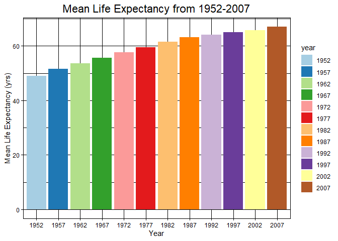
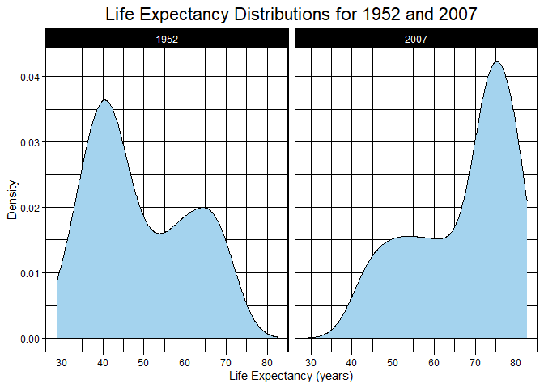
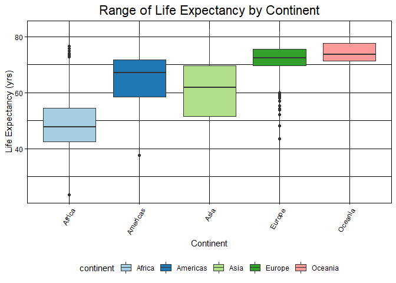
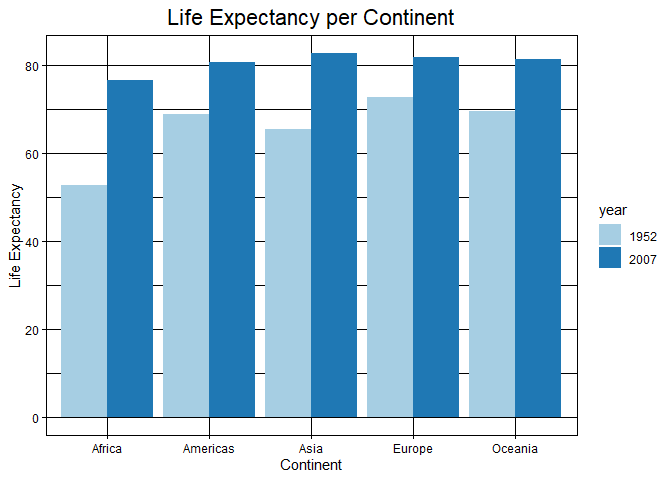
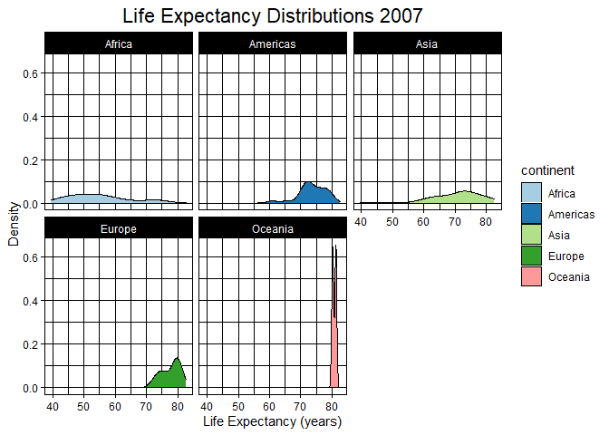

## Instructions
Answer the following questions and complete the exercises in RMarkdown. Please embed all of your code and push your final work to your repository. Your final lab report should be organized, clean, and run free from errors. Remember, you must remove the `#` for the included code chunks to run. Be sure to add your name to the author header above. For any included plots, make sure they are clearly labeled. You are free to use any plot type that you feel best communicates the results of your analysis.  

**In this homework, you should make use of the aesthetics you have learned. It's OK to be flashy!**

Make sure to use the formatting conventions of RMarkdown to make your report neat and clean!  

## Load the libraries

```r
library(tidyverse)
library(janitor)
library(here)
library(naniar)
```

## Resources
The idea for this assignment came from [Rebecca Barter's](http://www.rebeccabarter.com/blog/2017-11-17-ggplot2_tutorial/) ggplot tutorial so if you get stuck this is a good place to have a look.  

## Gapminder
For this assignment, we are going to use the dataset [gapminder](https://cran.r-project.org/web/packages/gapminder/index.html). Gapminder includes information about economics, population, and life expectancy from countries all over the world. You will need to install it before use. This is the same data that we will use for midterm 2 so this is good practice.

```r
#install.packages("gapminder")
library("gapminder")
```

## Questions
The questions below are open-ended and have many possible solutions. Your approach should, where appropriate, include numerical summaries and visuals. Be creative; assume you are building an analysis that you would ultimately present to an audience of stakeholders. Feel free to try out different `geoms` if they more clearly present your results.  

**1. Use the function(s) of your choice to get an idea of the overall structure of the data frame, including its dimensions, column names, variable classes, etc. As part of this, determine how NA's are treated in the data.**  

```r
glimpse(gapminder)
```

```
## Rows: 1,704
## Columns: 6
## $ country   <fct> Afghanistan, Afghanistan, Afghanistan, Afghanistan, Afghani…
## $ continent <fct> Asia, Asia, Asia, Asia, Asia, Asia, Asia, Asia, Asia, Asia,…
## $ year      <int> 1952, 1957, 1962, 1967, 1972, 1977, 1982, 1987, 1992, 1997,…
## $ lifeExp   <dbl> 28.801, 30.332, 31.997, 34.020, 36.088, 38.438, 39.854, 40.…
## $ pop       <int> 8425333, 9240934, 10267083, 11537966, 13079460, 14880372, 1…
## $ gdpPercap <dbl> 779.4453, 820.8530, 853.1007, 836.1971, 739.9811, 786.1134,…
```

```r
summary(gapminder)
```

```
##         country        continent        year         lifeExp     
##  Afghanistan:  12   Africa  :624   Min.   :1952   Min.   :23.60  
##  Albania    :  12   Americas:300   1st Qu.:1966   1st Qu.:48.20  
##  Algeria    :  12   Asia    :396   Median :1980   Median :60.71  
##  Angola     :  12   Europe  :360   Mean   :1980   Mean   :59.47  
##  Argentina  :  12   Oceania : 24   3rd Qu.:1993   3rd Qu.:70.85  
##  Australia  :  12                  Max.   :2007   Max.   :82.60  
##  (Other)    :1632                                                
##       pop              gdpPercap       
##  Min.   :6.001e+04   Min.   :   241.2  
##  1st Qu.:2.794e+06   1st Qu.:  1202.1  
##  Median :7.024e+06   Median :  3531.8  
##  Mean   :2.960e+07   Mean   :  7215.3  
##  3rd Qu.:1.959e+07   3rd Qu.:  9325.5  
##  Max.   :1.319e+09   Max.   :113523.1  
## 
```

```r
naniar::miss_var_summary(gapminder)
```

```
## # A tibble: 6 x 3
##   variable  n_miss pct_miss
##   <chr>      <int>    <dbl>
## 1 country        0        0
## 2 continent      0        0
## 3 year           0        0
## 4 lifeExp        0        0
## 5 pop            0        0
## 6 gdpPercap      0        0
```

**2. Among the interesting variables in gapminder is life expectancy. How has global life expectancy changed between 1952 and 2007?**

```r
gapminder2 <- gapminder %>% 
  group_by(year) %>% 
  summarize(mean_life_expectancy = mean(lifeExp))
```

```
## `summarise()` ungrouping output (override with `.groups` argument)
```

```r
gapminder2
```

```
## # A tibble: 12 x 2
##     year mean_life_expectancy
##    <int>                <dbl>
##  1  1952                 49.1
##  2  1957                 51.5
##  3  1962                 53.6
##  4  1967                 55.7
##  5  1972                 57.6
##  6  1977                 59.6
##  7  1982                 61.5
##  8  1987                 63.2
##  9  1992                 64.2
## 10  1997                 65.0
## 11  2002                 65.7
## 12  2007                 67.0
```

```r
gapminder2$year <- as.factor(gapminder2$year)
```


```r
gapminder2 %>% 
  ggplot(aes(x = year, y = mean_life_expectancy, fill = year)) +
  geom_col() +
  scale_fill_brewer(palette = "Paired") +
  labs(title = "Mean Life Expectancy from 1952-2007",
       x = "Year",
       y = "Mean Life Expectancy (yrs)") +
  theme_linedraw() +
  theme(plot.title = element_text(size = rel(1.5), hjust = 0.5))
```

<!-- -->


**3. How do the distributions of life expectancy compare for the years 1952 and 2007?**

```r
gapminder %>% 
  filter(year == "2007" | year == "1952") %>% 
  ggplot(aes(x = lifeExp)) +
  geom_density(fill = "lightskyblue2") + 
  facet_wrap(~year) +
  theme_linedraw() +
  labs(title = "Life Expectancy Distributions for 1952 and 2007",
       x = "Life Expectancy (years)",
       y = "Density") +
  theme(plot.title = element_text(size = rel(1.5), hjust = 0.5)) 
```

<!-- -->

**4. Your answer above doesn't tell the whole story since life expectancy varies by region. Make a summary that shows the min, mean, and max life expectancy by continent for all years represented in the data.**

```r
gapminder_3 <- gapminder %>% 
  group_by(continent, year) %>% 
  summarize(lifeExp, min_lifeExp = min(lifeExp), max_lifeExp = max(lifeExp), mean_lifeExp = mean(lifeExp)) %>% 
  arrange(mean_lifeExp)
```

```
## `summarise()` regrouping output by 'continent', 'year' (override with `.groups` argument)
```

```r
gapminder_3
```

```
## # A tibble: 1,704 x 6
## # Groups:   continent, year [60]
##    continent  year lifeExp min_lifeExp max_lifeExp mean_lifeExp
##    <fct>     <int>   <dbl>       <dbl>       <dbl>        <dbl>
##  1 Africa     1952    43.1          30        52.7         39.1
##  2 Africa     1952    30.0          30        52.7         39.1
##  3 Africa     1952    38.2          30        52.7         39.1
##  4 Africa     1952    47.6          30        52.7         39.1
##  5 Africa     1952    32.0          30        52.7         39.1
##  6 Africa     1952    39.0          30        52.7         39.1
##  7 Africa     1952    38.5          30        52.7         39.1
##  8 Africa     1952    35.5          30        52.7         39.1
##  9 Africa     1952    38.1          30        52.7         39.1
## 10 Africa     1952    40.7          30        52.7         39.1
## # … with 1,694 more rows
```

```r
gapminder_3$continent <- as.factor(gapminder_3$continent)
gapminder_3$year <- as.factor(gapminder_3$year)
```
Here are 2 interpretations of that question:
a. For each year in the time period

```r
gapminder_3 %>% 
  ggplot(aes(x = continent, y = lifeExp, fill = continent)) +
  geom_boxplot() +
  scale_fill_brewer(palette = "Paired") +
  labs(title = "Range of Life Expectancy by Continent",
       x = "Continent",
       y = "Life Expectancy (yrs)") +
  theme_linedraw() +
  theme(plot.title = element_text(size = rel(1.5), hjust = 0.5)) + 
  facet_wrap(~year) +
  theme(axis.text.x = element_text(angle = 60, hjust = 1)) + 
  theme(legend.position = "bottom")
```

<!-- -->
b. Across the entire time period

```r
gapminder_3 %>% 
  ggplot(aes(x = continent, y = lifeExp, fill = continent)) +
  geom_boxplot() +
  scale_fill_brewer(palette = "Paired") +
  labs(title = "Range of Life Expectancy by Continent",
       x = "Continent",
       y = "Life Expectancy (yrs)") +
  theme_linedraw() +
  theme(plot.title = element_text(size = rel(1.5), hjust = 0.5)) + 
  theme(axis.text.x = element_text(angle = 60, hjust = 1)) + 
  theme(legend.position = "bottom")
```

<!-- -->

**5. How has life expectancy changed between 1952-2007 for each continent?**

```r
gapminder$year <- as.factor(gapminder$year)
gapminder %>% 
  filter(year == 1952 | year == 2007) %>% 
  ggplot(aes(x = continent, y = lifeExp, fill = year)) +
  geom_col(position = "dodge") +
  labs(title = "Life Expectancy per Continent",
       x = "Continent",
       y = "Life Expectancy") +
  theme_linedraw() +
  theme(plot.title = element_text(size = rel(1.5), hjust = 0.5)) +
  scale_fill_brewer(palette = "Paired")
```

<!-- -->

**6. We are interested in the relationship between per capita GDP and life expectancy; i.e. does having more money help you live longer?**

```r
gapminder %>% 
  ggplot(aes(x = gdpPercap, y = lifeExp)) +
  geom_point(colour = "forestgreen") +
  scale_x_log10() +
  labs(title = "Life Expectancy vs Per Capita GDP",
       x = "Log10(Per Capita GDP)",
       y = "Life Expectancy") +
  theme_linedraw() +
  theme(plot.title = element_text(size = rel(1.5), hjust = 0.5))
```

<!-- -->

**7. Which countries have had the largest population growth since 1952?**
Note: GDP numbers are included in these dataframes for use in the next problem


```r
gapminder_2007 <- gapminder %>% 
  filter(year == 2007) %>% 
  select(country, pop, gdpPercap) %>% 
  rename(country_2007 = "country", pop_2007 = "pop", gdpPercap2007 = "gdpPercap")
gapminder_2007
```

```
## # A tibble: 142 x 3
##    country_2007  pop_2007 gdpPercap2007
##    <fct>            <int>         <dbl>
##  1 Afghanistan   31889923          975.
##  2 Albania        3600523         5937.
##  3 Algeria       33333216         6223.
##  4 Angola        12420476         4797.
##  5 Argentina     40301927        12779.
##  6 Australia     20434176        34435.
##  7 Austria        8199783        36126.
##  8 Bahrain         708573        29796.
##  9 Bangladesh   150448339         1391.
## 10 Belgium       10392226        33693.
## # … with 132 more rows
```


```r
gapminder_1952 <-
  gapminder %>% 
  filter (year == 1952) %>% 
  select(country, pop, gdpPercap) %>% 
  rename(pop_1952 = "pop", gdpPercap_1952 = "gdpPercap")
gapminder_1952
```

```
## # A tibble: 142 x 3
##    country     pop_1952 gdpPercap_1952
##    <fct>          <int>          <dbl>
##  1 Afghanistan  8425333           779.
##  2 Albania      1282697          1601.
##  3 Algeria      9279525          2449.
##  4 Angola       4232095          3521.
##  5 Argentina   17876956          5911.
##  6 Australia    8691212         10040.
##  7 Austria      6927772          6137.
##  8 Bahrain       120447          9867.
##  9 Bangladesh  46886859           684.
## 10 Belgium      8730405          8343.
## # … with 132 more rows
```


```r
gapminder_growth <- data_frame(gapminder_1952, gapminder_2007$pop_2007, gapminder_2007$gdpPercap2007)
```

```
## Warning: `data_frame()` is deprecated as of tibble 1.1.0.
## Please use `tibble()` instead.
## This warning is displayed once every 8 hours.
## Call `lifecycle::last_warnings()` to see where this warning was generated.
```

```r
gapminder_growth2 <- gapminder_growth %>% 
  rename(pop_2007 = "gapminder_2007$pop_2007", gdpPercap2007 = "gapminder_2007$gdpPercap2007") %>% 
  mutate(pop_growth = (pop_2007- pop_1952), gdp_growth = (gdpPercap2007 - gdpPercap_1952)) %>% 
  select(country, pop_growth, gdp_growth) %>% 
  arrange(desc(pop_growth))
gapminder_growth2
```

```
## # A tibble: 142 x 3
##    country       pop_growth gdp_growth
##    <fct>              <int>      <dbl>
##  1 China          762419569      4559.
##  2 India          738396331      1906.
##  3 United States  143586947     28961.
##  4 Indonesia      141495000      2791.
##  5 Brazil         133408087      6957.
##  6 Pakistan       127924057      1921.
##  7 Bangladesh     103561480       707.
##  8 Nigeria        101912068       937.
##  9 Mexico          78556574      8499.
## 10 Philippines     68638596      1918.
## # … with 132 more rows
```

**8. Use your results from the question above to plot population growth for the top five countries since 1952.**

```r
gapminder_growth2 %>% 
  filter(pop_growth > 130000000) %>% 
  ggplot(aes(x = country, y = pop_growth, fill = country)) +
  geom_col() +
  labs(title = "Population Growth by Country, 1952-2007",
       x = "Country",
       y = "Population Growth") +
  theme_linedraw() +
  theme(plot.title = element_text(size = rel(1.5), hjust = 0.5)) +
  scale_fill_brewer(palette = "Paired")
```

<!-- -->

**9. How does per-capita GDP growth compare between these same five countries?**

```r
gapminder_growth2 %>% 
  filter(country == "Brazil" | country == "China" | country == "India" 
         | country == "Indonesia" | country == "United States") %>% 
  ggplot(aes(x = country, y = gdp_growth, fill = country)) +
  geom_col() +
  labs(title = "Per Capita GDP Growth by Country, 1952-2007",
       x = "Country",
       y = "Per Capita GDP Growth") +
  theme_linedraw() +
  theme(plot.title = element_text(size = rel(1.5), hjust = 0.5)) +
  scale_fill_brewer(palette = "Paired")
```

<!-- -->

**10. Make one plot of your choice that uses faceting!**

```r
gapminder %>% 
  filter(year == 2007) %>% 
  ggplot(aes(x = lifeExp, fill = continent)) +
  geom_density() + 
  facet_wrap(~continent) +
  theme_linedraw() +
  labs(title = "Life Expectancy Distributions 2007",
       x = "Life Expectancy (years)",
       y = "Density") +
  theme(plot.title = element_text(size = rel(1.5), hjust = 0.5)) +
  scale_fill_brewer(palette = "Paired")
```

<!-- -->

## Push your final code to GitHub!
Please be sure that you check the `keep md` file in the knit preferences. 
