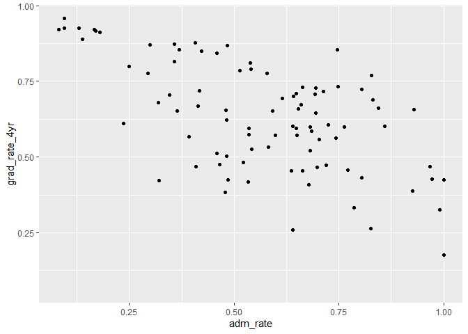
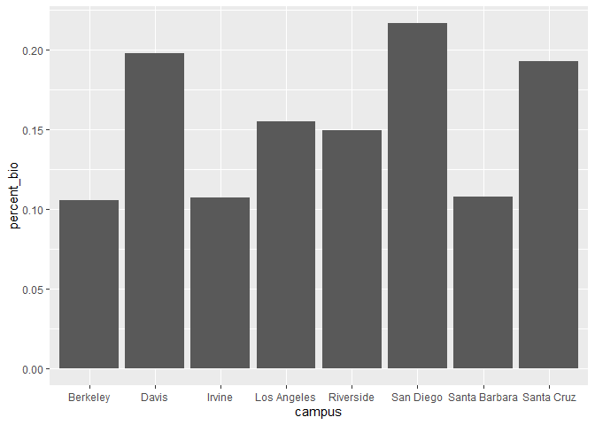

## Instructions
Answer the following questions and complete the exercises in RMarkdown. Please embed all of your code and push your final work to your repository. Your final lab report should be organized, clean, and run free from errors. Remember, you must remove the `#` for the included code chunks to run. Be sure to add your name to the author header above.  

Make sure to use the formatting conventions of RMarkdown to make your report neat and clean!  

## Load the libraries

```r
library(tidyverse)
library(janitor)
library(here)
library(naniar)
library(skimr)
```

For this homework, we will take a departure from biological data and use data about California colleges. These data are a subset of the national college scorecard (https://collegescorecard.ed.gov/data/). Load the `ca_college_data.csv` as a new object called `colleges`.

```r
colleges <- read_csv(here("lab9", "data", "ca_college_data.csv"))
```

```
## 
## -- Column specification --------------------------------------------------------
## cols(
##   INSTNM = col_character(),
##   CITY = col_character(),
##   STABBR = col_character(),
##   ZIP = col_character(),
##   ADM_RATE = col_double(),
##   SAT_AVG = col_double(),
##   PCIP26 = col_double(),
##   COSTT4_A = col_double(),
##   C150_4_POOLED = col_double(),
##   PFTFTUG1_EF = col_double()
## )
```

```r
colleges
```

```
## # A tibble: 341 x 10
##    INSTNM CITY  STABBR ZIP   ADM_RATE SAT_AVG PCIP26 COSTT4_A C150_4_POOLED
##    <chr>  <chr> <chr>  <chr>    <dbl>   <dbl>  <dbl>    <dbl>         <dbl>
##  1 Gross~ El C~ CA     9202~       NA      NA 0.0016     7956        NA    
##  2 Colle~ Visa~ CA     9327~       NA      NA 0.0066     8109        NA    
##  3 Colle~ San ~ CA     9440~       NA      NA 0.0038     8278        NA    
##  4 Ventu~ Vent~ CA     9300~       NA      NA 0.0035     8407        NA    
##  5 Oxnar~ Oxna~ CA     9303~       NA      NA 0.0085     8516        NA    
##  6 Moorp~ Moor~ CA     9302~       NA      NA 0.0151     8577        NA    
##  7 Skyli~ San ~ CA     9406~       NA      NA 0          8580         0.233
##  8 Glend~ Glen~ CA     9120~       NA      NA 0.002      9181        NA    
##  9 Citru~ Glen~ CA     9174~       NA      NA 0.0021     9281        NA    
## 10 Fresn~ Fres~ CA     93741       NA      NA 0.0324     9370        NA    
## # ... with 331 more rows, and 1 more variable: PFTFTUG1_EF <dbl>
```

The variables are a bit hard to decipher, here is a key:  

INSTNM: Institution name  
CITY: California city  
STABBR: Location state  
ZIP: Zip code  
ADM_RATE: Admission rate  
SAT_AVG: SAT average score  
PCIP26: Percentage of degrees awarded in Biological And Biomedical Sciences  
COSTT4_A: Annual cost of attendance  
C150_4_POOLED: 4-year completion rate  
PFTFTUG1_EF: Percentage of undergraduate students who are first-time, full-time degree/certificate-seeking undergraduate students  

1. Use your preferred function(s) to have a look at the data and get an idea of its structure. Make sure you summarize NA's and determine whether or not the data are tidy. You may also consider dealing with any naming issues.

```r
glimpse(colleges)
```

```
## Rows: 341
## Columns: 10
## $ INSTNM        <chr> "Grossmont College", "College of the Sequoias", "Coll...
## $ CITY          <chr> "El Cajon", "Visalia", "San Mateo", "Ventura", "Oxnar...
## $ STABBR        <chr> "CA", "CA", "CA", "CA", "CA", "CA", "CA", "CA", "CA",...
## $ ZIP           <chr> "92020-1799", "93277-2214", "94402-3784", "93003-3872...
## $ ADM_RATE      <dbl> NA, NA, NA, NA, NA, NA, NA, NA, NA, NA, NA, NA, NA, N...
## $ SAT_AVG       <dbl> NA, NA, NA, NA, NA, NA, NA, NA, NA, NA, NA, NA, NA, N...
## $ PCIP26        <dbl> 0.0016, 0.0066, 0.0038, 0.0035, 0.0085, 0.0151, 0.000...
## $ COSTT4_A      <dbl> 7956, 8109, 8278, 8407, 8516, 8577, 8580, 9181, 9281,...
## $ C150_4_POOLED <dbl> NA, NA, NA, NA, NA, NA, 0.2334, NA, NA, NA, NA, 0.170...
## $ PFTFTUG1_EF   <dbl> 0.3546, 0.5413, 0.3567, 0.3824, 0.2753, 0.4286, 0.230...
```


```r
skim(colleges)
```


Table: Data summary

|                         |         |
|:------------------------|:--------|
|Name                     |colleges |
|Number of rows           |341      |
|Number of columns        |10       |
|_______________________  |         |
|Column type frequency:   |         |
|character                |4        |
|numeric                  |6        |
|________________________ |         |
|Group variables          |None     |


**Variable type: character**

|skim_variable | n_missing| complete_rate| min| max| empty| n_unique| whitespace|
|:-------------|---------:|-------------:|---:|---:|-----:|--------:|----------:|
|INSTNM        |         0|             1|  10|  63|     0|      341|          0|
|CITY          |         0|             1|   4|  19|     0|      161|          0|
|STABBR        |         0|             1|   2|   2|     0|        3|          0|
|ZIP           |         0|             1|   5|  10|     0|      324|          0|


**Variable type: numeric**

|skim_variable | n_missing| complete_rate|     mean|       sd|      p0|      p25|      p50|      p75|     p100|hist  |
|:-------------|---------:|-------------:|--------:|--------:|-------:|--------:|--------:|--------:|--------:|:-----|
|ADM_RATE      |       240|          0.30|     0.59|     0.23|    0.08|     0.46|     0.64|     0.75|     1.00|▂▃▆▇▃ |
|SAT_AVG       |       276|          0.19|  1112.31|   170.80|  870.00|   985.00|  1078.00|  1237.00|  1555.00|▇▇▅▂▂ |
|PCIP26        |        35|          0.90|     0.02|     0.04|    0.00|     0.00|     0.00|     0.02|     0.22|▇▁▁▁▁ |
|COSTT4_A      |       124|          0.64| 26685.17| 18122.70| 7956.00| 12578.00| 16591.00| 39289.00| 69355.00|▇▂▂▁▂ |
|C150_4_POOLED |       221|          0.35|     0.57|     0.21|    0.06|     0.43|     0.58|     0.72|     0.96|▂▃▇▇▅ |
|PFTFTUG1_EF   |        53|          0.84|     0.56|     0.29|    0.01|     0.32|     0.50|     0.81|     1.00|▃▇▆▅▇ |


```r
colleges<- clean_names(colleges)
names(colleges)
```

```
##  [1] "instnm"        "city"          "stabbr"        "zip"          
##  [5] "adm_rate"      "sat_avg"       "pcip26"        "costt4_a"     
##  [9] "c150_4_pooled" "pftftug1_ef"
```


```r
colleges_tidy<- 
  rename(colleges, institution = "instnm", state = "stabbr", percent_bio = "pcip26", annual_cost = "costt4_a", grad_rate_4yr = "c150_4_pooled", percent_new_students = "pftftug1_ef")
colleges_tidy
```

```
## # A tibble: 341 x 10
##    institution city  state zip   adm_rate sat_avg percent_bio annual_cost
##    <chr>       <chr> <chr> <chr>    <dbl>   <dbl>       <dbl>       <dbl>
##  1 Grossmont ~ El C~ CA    9202~       NA      NA      0.0016        7956
##  2 College of~ Visa~ CA    9327~       NA      NA      0.0066        8109
##  3 College of~ San ~ CA    9440~       NA      NA      0.0038        8278
##  4 Ventura Co~ Vent~ CA    9300~       NA      NA      0.0035        8407
##  5 Oxnard Col~ Oxna~ CA    9303~       NA      NA      0.0085        8516
##  6 Moorpark C~ Moor~ CA    9302~       NA      NA      0.0151        8577
##  7 Skyline Co~ San ~ CA    9406~       NA      NA      0             8580
##  8 Glendale C~ Glen~ CA    9120~       NA      NA      0.002         9181
##  9 Citrus Col~ Glen~ CA    9174~       NA      NA      0.0021        9281
## 10 Fresno Cit~ Fres~ CA    93741       NA      NA      0.0324        9370
## # ... with 331 more rows, and 2 more variables: grad_rate_4yr <dbl>,
## #   percent_new_students <dbl>
```

2. Which cities in California have the highest number of colleges?

```r
most_colleges <- colleges_tidy %>% 
  count(city) %>% 
  arrange(desc(n))
most_colleges
```

```
## # A tibble: 161 x 2
##    city              n
##    <chr>         <int>
##  1 Los Angeles      24
##  2 San Diego        18
##  3 San Francisco    15
##  4 Sacramento       10
##  5 Berkeley          9
##  6 Oakland           9
##  7 Claremont         7
##  8 Pasadena          6
##  9 Fresno            5
## 10 Irvine            5
## # ... with 151 more rows
```

3. Based on your answer to #2, make a plot that shows the number of colleges in the top 10 cities.

```r
most_colleges %>% 
  top_n(10) %>% 
  ggplot(aes(x = reorder(city, n), y = n)) +
  geom_col() +
  coord_flip()
```

```
## Selecting by n
```

<!-- -->

4. The column `COSTT4_A` is the annual cost of each institution. Which city has the highest average cost? Where is it located?
Answer: Claremont

```r
colleges_by_price <- 
  colleges_tidy %>% 
  group_by(city) %>% 
  summarize(mean_cost = mean(annual_cost, na.rm = T)) %>% 
  arrange(desc(mean_cost))
colleges_by_price
```

```
## # A tibble: 161 x 2
##    city                mean_cost
##    <chr>                   <dbl>
##  1 Claremont               66498
##  2 Malibu                  66152
##  3 Valencia                64686
##  4 Orange                  64501
##  5 Redlands                61542
##  6 Moraga                  61095
##  7 Atherton                56035
##  8 Thousand Oaks           54373
##  9 Rancho Palos Verdes     50758
## 10 La Verne                50603
## # ... with 151 more rows
```

5. Based on your answer to #4, make a plot that compares the cost of the individual colleges in the most expensive city. Bonus! Add UC Davis here to see how it compares :>).

```r
colleges_tidy %>% 
  filter(city == "Claremont" | city == "Davis") %>% 
  filter(!is.na(annual_cost)) %>% 
  ggplot(aes(x = reorder(institution, annual_cost), y = annual_cost)) +
  geom_col(na.rm = T) +
  coord_flip()
```

<!-- -->

6. The column `ADM_RATE` is the admissions rate by college and `C150_4_POOLED` is the four-year completion rate. Use a scatterplot to show the relationship between these two variables. What do you think this means?

There is a negative correlation, so that the higher the admit rate, the smaller the 4 year graduation rate. This may suggest that a more committed caliber of student is accepted to the more exclusive institutions.

```r
colleges_tidy %>% 
  ggplot(aes(x = adm_rate, y = grad_rate_4yr)) +
  geom_point(na.rm = T)
```

<!-- -->

7. Is there a relationship between cost and four-year completion rate? (You don't need to do the stats, just produce a plot). What do you think this means?

There is a positive correlation, where the most expensive institutions have the greatest 4 year graduation rate. This may mean that the more expensive schools have more resources to encourage timely graduation.

```r
colleges_tidy %>% 
  ggplot(aes(x = annual_cost, y = grad_rate_4yr)) +
  geom_point(na.rm = T) +
  geom_smooth(method = lm, se = T, na.rm = T)
```

```
## `geom_smooth()` using formula 'y ~ x'
```

<!-- -->

8. The column titled `INSTNM` is the institution name. We are only interested in the University of California colleges. Make a new data frame that is restricted to UC institutions. You can remove `Hastings College of Law` and `UC San Francisco` as we are only interested in undergraduate institutions.

```r
  colleges_tidy %>% 
  filter(str_detect(institution, "University of California"))
```

```
## # A tibble: 10 x 10
##    institution city  state zip   adm_rate sat_avg percent_bio annual_cost
##    <chr>       <chr> <chr> <chr>    <dbl>   <dbl>       <dbl>       <dbl>
##  1 University~ La J~ CA    92093    0.357    1324       0.216       31043
##  2 University~ Irvi~ CA    92697    0.406    1206       0.107       31198
##  3 University~ Rive~ CA    92521    0.663    1078       0.149       31494
##  4 University~ Los ~ CA    9009~    0.180    1334       0.155       33078
##  5 University~ Davis CA    9561~    0.423    1218       0.198       33904
##  6 University~ Sant~ CA    9506~    0.578    1201       0.193       34608
##  7 University~ Berk~ CA    94720    0.169    1422       0.105       34924
##  8 University~ Sant~ CA    93106    0.358    1281       0.108       34998
##  9 University~ San ~ CA    9410~   NA          NA      NA              NA
## 10 University~ San ~ CA    9414~   NA          NA      NA              NA
## # ... with 2 more variables: grad_rate_4yr <dbl>, percent_new_students <dbl>
```

Remove `Hastings College of Law` and `UC San Francisco` and store the final data frame as a new object `univ_calif_final`.

```r
univ_calif_final <-
  colleges_tidy %>% 
  filter(str_detect(institution, "University of California")) %>% 
  filter( city != "San Francisco")
univ_calif_final
```

```
## # A tibble: 8 x 10
##   institution city  state zip   adm_rate sat_avg percent_bio annual_cost
##   <chr>       <chr> <chr> <chr>    <dbl>   <dbl>       <dbl>       <dbl>
## 1 University~ La J~ CA    92093    0.357    1324       0.216       31043
## 2 University~ Irvi~ CA    92697    0.406    1206       0.107       31198
## 3 University~ Rive~ CA    92521    0.663    1078       0.149       31494
## 4 University~ Los ~ CA    9009~    0.180    1334       0.155       33078
## 5 University~ Davis CA    9561~    0.423    1218       0.198       33904
## 6 University~ Sant~ CA    9506~    0.578    1201       0.193       34608
## 7 University~ Berk~ CA    94720    0.169    1422       0.105       34924
## 8 University~ Sant~ CA    93106    0.358    1281       0.108       34998
## # ... with 2 more variables: grad_rate_4yr <dbl>, percent_new_students <dbl>
```

Use `separate()` to separate institution name into two new columns "UNIV" and "CAMPUS".

```r
univ_calif_campuses <- univ_calif_final %>% 
  separate(institution, into = c("univ", "campus"), sep = "-")
univ_calif_campuses
```

```
## # A tibble: 8 x 11
##   univ  campus city  state zip   adm_rate sat_avg percent_bio annual_cost
##   <chr> <chr>  <chr> <chr> <chr>    <dbl>   <dbl>       <dbl>       <dbl>
## 1 Univ~ San D~ La J~ CA    92093    0.357    1324       0.216       31043
## 2 Univ~ Irvine Irvi~ CA    92697    0.406    1206       0.107       31198
## 3 Univ~ River~ Rive~ CA    92521    0.663    1078       0.149       31494
## 4 Univ~ Los A~ Los ~ CA    9009~    0.180    1334       0.155       33078
## 5 Univ~ Davis  Davis CA    9561~    0.423    1218       0.198       33904
## 6 Univ~ Santa~ Sant~ CA    9506~    0.578    1201       0.193       34608
## 7 Univ~ Berke~ Berk~ CA    94720    0.169    1422       0.105       34924
## 8 Univ~ Santa~ Sant~ CA    93106    0.358    1281       0.108       34998
## # ... with 2 more variables: grad_rate_4yr <dbl>, percent_new_students <dbl>
```

9. The column `ADM_RATE` is the admissions rate by campus. Which UC has the lowest and highest admissions rates? Produce a numerical summary and an appropriate plot.

```r
univ_calif_campuses %>% 
  select(campus, adm_rate) %>% 
  arrange(desc(adm_rate))
```

```
## # A tibble: 8 x 2
##   campus        adm_rate
##   <chr>            <dbl>
## 1 Riverside        0.663
## 2 Santa Cruz       0.578
## 3 Davis            0.423
## 4 Irvine           0.406
## 5 Santa Barbara    0.358
## 6 San Diego        0.357
## 7 Los Angeles      0.180
## 8 Berkeley         0.169
```


```r
univ_calif_campuses %>% 
  ggplot(aes(x = campus, y = adm_rate)) +
  geom_col()
```

<!-- -->

10. If you wanted to get a degree in biological or biomedical sciences, which campus confers the majority of these degrees? Produce a numerical summary and an appropriate plot.

```r
univ_calif_campuses %>% 
  select(campus, percent_bio) %>% 
  arrange(desc(percent_bio))
```

```
## # A tibble: 8 x 2
##   campus        percent_bio
##   <chr>               <dbl>
## 1 San Diego           0.216
## 2 Davis               0.198
## 3 Santa Cruz          0.193
## 4 Los Angeles         0.155
## 5 Riverside           0.149
## 6 Santa Barbara       0.108
## 7 Irvine              0.107
## 8 Berkeley            0.105
```


```r
univ_calif_campuses %>% 
  ggplot(aes(x = campus, y = percent_bio)) +
  geom_col()
```

<!-- -->

## Knit Your Output and Post to [GitHub](https://github.com/FRS417-DataScienceBiologists)
