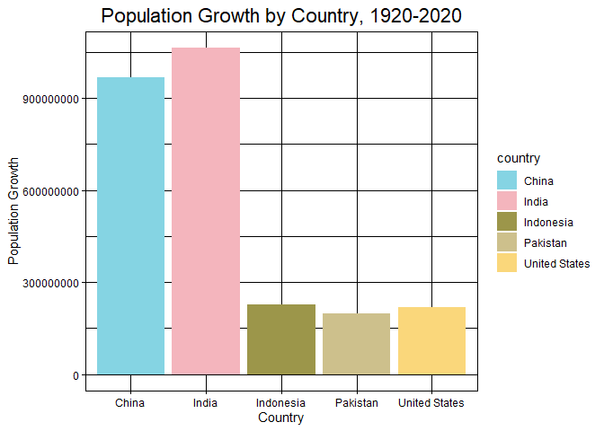
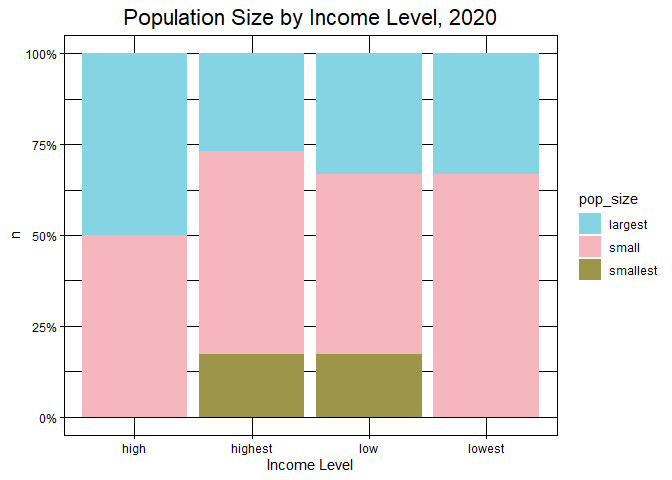

## Instructions
Answer the following questions and complete the exercises in RMarkdown. Please embed all of your code and push your final work to your repository. Your code should be organized, clean, and run free from errors. Be sure to **add your name** to the author header above. You may use any resources to answer these questions (including each other), but you may not post questions to Open Stacks or external help sites. There are 10 total questions.  

Make sure to use the formatting conventions of RMarkdown to make your report neat and clean! Your plots should use consistent aesthetics throughout. Feel free to be creative- there are many possible solutions to these questions!  

This exam is due by **12:00p on Tuesday, February 23**.  

## Load the libraries

```r
library(tidyverse)
```

```
## -- Attaching packages --------------------------------------- tidyverse 1.3.0 --
```

```
## √ ggplot2 3.3.3     √ purrr   0.3.4
## √ tibble  3.0.6     √ dplyr   1.0.4
## √ tidyr   1.1.2     √ stringr 1.4.0
## √ readr   1.4.0     √ forcats 0.5.1
```

```
## -- Conflicts ------------------------------------------ tidyverse_conflicts() --
## x dplyr::filter() masks stats::filter()
## x dplyr::lag()    masks stats::lag()
```

```r
library(janitor)
```

```
## 
## Attaching package: 'janitor'
```

```
## The following objects are masked from 'package:stats':
## 
##     chisq.test, fisher.test
```

```r
library(here)
```

```
## here() starts at D:/TA files/Winter2021 BIS15L/students_rep/BIS15W2021_aandre
```

```r
library(wesanderson)
options(scipen=999) #disables scientific notation when printing
```

## Gapminder
For this assignment, we are going to use data from  [gapminder](https://www.gapminder.org/). Gapminder includes information about economics, population, social issues, and life expectancy from countries all over the world. We will use three data sets, so please load all three.  

One thing to note is that the data include years beyond 2021. These are projections based on modeling done by the gapminder organization. Start by importing the data.

```r
population <- read_csv(here("midterm2", "data", "population_total.csv"))
```

```
## 
## -- Column specification --------------------------------------------------------
## cols(
##   .default = col_double(),
##   country = col_character()
## )
## i Use `spec()` for the full column specifications.
```

```r
population
```

```
## # A tibble: 195 x 302
##    country `1800` `1801` `1802` `1803` `1804` `1805` `1806` `1807` `1808` `1809`
##    <chr>    <dbl>  <dbl>  <dbl>  <dbl>  <dbl>  <dbl>  <dbl>  <dbl>  <dbl>  <dbl>
##  1 Afghan~ 3.28e6 3.28e6 3.28e6 3.28e6 3.28e6 3.28e6 3.28e6 3.28e6 3.28e6 3.28e6
##  2 Albania 4.00e5 4.02e5 4.04e5 4.05e5 4.07e5 4.09e5 4.11e5 4.13e5 4.14e5 4.16e5
##  3 Algeria 2.50e6 2.51e6 2.52e6 2.53e6 2.54e6 2.55e6 2.56e6 2.56e6 2.57e6 2.58e6
##  4 Andorra 2.65e3 2.65e3 2.65e3 2.65e3 2.65e3 2.65e3 2.65e3 2.65e3 2.65e3 2.65e3
##  5 Angola  1.57e6 1.57e6 1.57e6 1.57e6 1.57e6 1.57e6 1.57e6 1.57e6 1.57e6 1.57e6
##  6 Antigu~ 3.70e4 3.70e4 3.70e4 3.70e4 3.70e4 3.70e4 3.70e4 3.70e4 3.70e4 3.70e4
##  7 Argent~ 5.34e5 5.20e5 5.06e5 4.92e5 4.79e5 4.66e5 4.53e5 4.41e5 4.29e5 4.17e5
##  8 Armenia 4.13e5 4.13e5 4.13e5 4.13e5 4.13e5 4.13e5 4.13e5 4.13e5 4.13e5 4.13e5
##  9 Austra~ 2.00e5 2.05e5 2.11e5 2.16e5 2.22e5 2.27e5 2.33e5 2.39e5 2.46e5 2.52e5
## 10 Austria 3.00e6 3.02e6 3.04e6 3.05e6 3.07e6 3.09e6 3.11e6 3.12e6 3.14e6 3.16e6
## # ... with 185 more rows, and 291 more variables: 1810 <dbl>, 1811 <dbl>,
## #   1812 <dbl>, 1813 <dbl>, 1814 <dbl>, 1815 <dbl>, 1816 <dbl>, 1817 <dbl>,
## #   1818 <dbl>, 1819 <dbl>, 1820 <dbl>, 1821 <dbl>, 1822 <dbl>, 1823 <dbl>,
## #   1824 <dbl>, 1825 <dbl>, 1826 <dbl>, 1827 <dbl>, 1828 <dbl>, 1829 <dbl>,
## #   1830 <dbl>, 1831 <dbl>, 1832 <dbl>, 1833 <dbl>, 1834 <dbl>, 1835 <dbl>,
## #   1836 <dbl>, 1837 <dbl>, 1838 <dbl>, 1839 <dbl>, 1840 <dbl>, 1841 <dbl>,
## #   1842 <dbl>, 1843 <dbl>, 1844 <dbl>, 1845 <dbl>, 1846 <dbl>, 1847 <dbl>,
## #   1848 <dbl>, 1849 <dbl>, 1850 <dbl>, 1851 <dbl>, 1852 <dbl>, 1853 <dbl>,
## #   1854 <dbl>, 1855 <dbl>, 1856 <dbl>, 1857 <dbl>, 1858 <dbl>, 1859 <dbl>,
## #   1860 <dbl>, 1861 <dbl>, 1862 <dbl>, 1863 <dbl>, 1864 <dbl>, 1865 <dbl>,
## #   1866 <dbl>, 1867 <dbl>, 1868 <dbl>, 1869 <dbl>, 1870 <dbl>, 1871 <dbl>,
## #   1872 <dbl>, 1873 <dbl>, 1874 <dbl>, 1875 <dbl>, 1876 <dbl>, 1877 <dbl>,
## #   1878 <dbl>, 1879 <dbl>, 1880 <dbl>, 1881 <dbl>, 1882 <dbl>, 1883 <dbl>,
## #   1884 <dbl>, 1885 <dbl>, 1886 <dbl>, 1887 <dbl>, 1888 <dbl>, 1889 <dbl>,
## #   1890 <dbl>, 1891 <dbl>, 1892 <dbl>, 1893 <dbl>, 1894 <dbl>, 1895 <dbl>,
## #   1896 <dbl>, 1897 <dbl>, 1898 <dbl>, 1899 <dbl>, 1900 <dbl>, 1901 <dbl>,
## #   1902 <dbl>, 1903 <dbl>, 1904 <dbl>, 1905 <dbl>, 1906 <dbl>, 1907 <dbl>,
## #   1908 <dbl>, 1909 <dbl>, ...
```


```r
income <- read_csv(here("midterm2", "data", "income_per_person_gdppercapita_ppp_inflation_adjusted.csv"))
```

```
## 
## -- Column specification --------------------------------------------------------
## cols(
##   .default = col_double(),
##   country = col_character()
## )
## i Use `spec()` for the full column specifications.
```

```r
income
```

```
## # A tibble: 193 x 242
##    country `1800` `1801` `1802` `1803` `1804` `1805` `1806` `1807` `1808` `1809`
##    <chr>    <dbl>  <dbl>  <dbl>  <dbl>  <dbl>  <dbl>  <dbl>  <dbl>  <dbl>  <dbl>
##  1 Afghan~    603    603    603    603    603    603    603    603    603    603
##  2 Albania    667    667    667    667    667    668    668    668    668    668
##  3 Algeria    715    716    717    718    719    720    721    722    723    724
##  4 Andorra   1200   1200   1200   1200   1210   1210   1210   1210   1220   1220
##  5 Angola     618    620    623    626    628    631    634    637    640    642
##  6 Antigu~    757    757    757    757    757    757    757    758    758    758
##  7 Argent~   1640   1640   1650   1650   1660   1660   1670   1680   1680   1690
##  8 Armenia    514    514    514    514    514    514    514    514    514    514
##  9 Austra~    817    822    826    831    836    841    845    850    855    860
## 10 Austria   1850   1850   1860   1870   1880   1880   1890   1900   1910   1920
## # ... with 183 more rows, and 231 more variables: 1810 <dbl>, 1811 <dbl>,
## #   1812 <dbl>, 1813 <dbl>, 1814 <dbl>, 1815 <dbl>, 1816 <dbl>, 1817 <dbl>,
## #   1818 <dbl>, 1819 <dbl>, 1820 <dbl>, 1821 <dbl>, 1822 <dbl>, 1823 <dbl>,
## #   1824 <dbl>, 1825 <dbl>, 1826 <dbl>, 1827 <dbl>, 1828 <dbl>, 1829 <dbl>,
## #   1830 <dbl>, 1831 <dbl>, 1832 <dbl>, 1833 <dbl>, 1834 <dbl>, 1835 <dbl>,
## #   1836 <dbl>, 1837 <dbl>, 1838 <dbl>, 1839 <dbl>, 1840 <dbl>, 1841 <dbl>,
## #   1842 <dbl>, 1843 <dbl>, 1844 <dbl>, 1845 <dbl>, 1846 <dbl>, 1847 <dbl>,
## #   1848 <dbl>, 1849 <dbl>, 1850 <dbl>, 1851 <dbl>, 1852 <dbl>, 1853 <dbl>,
## #   1854 <dbl>, 1855 <dbl>, 1856 <dbl>, 1857 <dbl>, 1858 <dbl>, 1859 <dbl>,
## #   1860 <dbl>, 1861 <dbl>, 1862 <dbl>, 1863 <dbl>, 1864 <dbl>, 1865 <dbl>,
## #   1866 <dbl>, 1867 <dbl>, 1868 <dbl>, 1869 <dbl>, 1870 <dbl>, 1871 <dbl>,
## #   1872 <dbl>, 1873 <dbl>, 1874 <dbl>, 1875 <dbl>, 1876 <dbl>, 1877 <dbl>,
## #   1878 <dbl>, 1879 <dbl>, 1880 <dbl>, 1881 <dbl>, 1882 <dbl>, 1883 <dbl>,
## #   1884 <dbl>, 1885 <dbl>, 1886 <dbl>, 1887 <dbl>, 1888 <dbl>, 1889 <dbl>,
## #   1890 <dbl>, 1891 <dbl>, 1892 <dbl>, 1893 <dbl>, 1894 <dbl>, 1895 <dbl>,
## #   1896 <dbl>, 1897 <dbl>, 1898 <dbl>, 1899 <dbl>, 1900 <dbl>, 1901 <dbl>,
## #   1902 <dbl>, 1903 <dbl>, 1904 <dbl>, 1905 <dbl>, 1906 <dbl>, 1907 <dbl>,
## #   1908 <dbl>, 1909 <dbl>, ...
```


```r
life_expectancy <- read_csv(here("midterm2", "data", "life_expectancy_years.csv"))
```

```
## 
## -- Column specification --------------------------------------------------------
## cols(
##   .default = col_double(),
##   country = col_character()
## )
## i Use `spec()` for the full column specifications.
```

```r
life_expectancy
```

```
## # A tibble: 187 x 302
##    country `1800` `1801` `1802` `1803` `1804` `1805` `1806` `1807` `1808` `1809`
##    <chr>    <dbl>  <dbl>  <dbl>  <dbl>  <dbl>  <dbl>  <dbl>  <dbl>  <dbl>  <dbl>
##  1 Afghan~   28.2   28.2   28.2   28.2   28.2   28.2   28.1   28.1   28.1   28.1
##  2 Albania   35.4   35.4   35.4   35.4   35.4   35.4   35.4   35.4   35.4   35.4
##  3 Algeria   28.8   28.8   28.8   28.8   28.8   28.8   28.8   28.8   28.8   28.8
##  4 Andorra   NA     NA     NA     NA     NA     NA     NA     NA     NA     NA  
##  5 Angola    27     27     27     27     27     27     27     27     27     27  
##  6 Antigu~   33.5   33.5   33.5   33.5   33.5   33.5   33.5   33.5   33.5   33.5
##  7 Argent~   33.2   33.2   33.2   33.2   33.2   33.2   33.2   33.2   33.2   33.2
##  8 Armenia   34     34     34     34     34     34     34     34     34     34  
##  9 Austra~   34     34     34     34     34     34     34     34     34     34  
## 10 Austria   34.4   34.4   34.4   34.4   34.4   34.4   34.4   34.4   34.4   34.4
## # ... with 177 more rows, and 291 more variables: 1810 <dbl>, 1811 <dbl>,
## #   1812 <dbl>, 1813 <dbl>, 1814 <dbl>, 1815 <dbl>, 1816 <dbl>, 1817 <dbl>,
## #   1818 <dbl>, 1819 <dbl>, 1820 <dbl>, 1821 <dbl>, 1822 <dbl>, 1823 <dbl>,
## #   1824 <dbl>, 1825 <dbl>, 1826 <dbl>, 1827 <dbl>, 1828 <dbl>, 1829 <dbl>,
## #   1830 <dbl>, 1831 <dbl>, 1832 <dbl>, 1833 <dbl>, 1834 <dbl>, 1835 <dbl>,
## #   1836 <dbl>, 1837 <dbl>, 1838 <dbl>, 1839 <dbl>, 1840 <dbl>, 1841 <dbl>,
## #   1842 <dbl>, 1843 <dbl>, 1844 <dbl>, 1845 <dbl>, 1846 <dbl>, 1847 <dbl>,
## #   1848 <dbl>, 1849 <dbl>, 1850 <dbl>, 1851 <dbl>, 1852 <dbl>, 1853 <dbl>,
## #   1854 <dbl>, 1855 <dbl>, 1856 <dbl>, 1857 <dbl>, 1858 <dbl>, 1859 <dbl>,
## #   1860 <dbl>, 1861 <dbl>, 1862 <dbl>, 1863 <dbl>, 1864 <dbl>, 1865 <dbl>,
## #   1866 <dbl>, 1867 <dbl>, 1868 <dbl>, 1869 <dbl>, 1870 <dbl>, 1871 <dbl>,
## #   1872 <dbl>, 1873 <dbl>, 1874 <dbl>, 1875 <dbl>, 1876 <dbl>, 1877 <dbl>,
## #   1878 <dbl>, 1879 <dbl>, 1880 <dbl>, 1881 <dbl>, 1882 <dbl>, 1883 <dbl>,
## #   1884 <dbl>, 1885 <dbl>, 1886 <dbl>, 1887 <dbl>, 1888 <dbl>, 1889 <dbl>,
## #   1890 <dbl>, 1891 <dbl>, 1892 <dbl>, 1893 <dbl>, 1894 <dbl>, 1895 <dbl>,
## #   1896 <dbl>, 1897 <dbl>, 1898 <dbl>, 1899 <dbl>, 1900 <dbl>, 1901 <dbl>,
## #   1902 <dbl>, 1903 <dbl>, 1904 <dbl>, 1905 <dbl>, 1906 <dbl>, 1907 <dbl>,
## #   1908 <dbl>, 1909 <dbl>, ...
```

1. (3 points) Once you have an idea of the structure of the data, please make each data set tidy and store them as new objects. You will need both the original and tidy data!

```r
population_tidy <-
  population %>% 
  pivot_longer(-country,
               names_to = "year",
               values_to = "pop", 
               values_drop_na = FALSE)
population_tidy
```

```
## # A tibble: 58,695 x 3
##    country     year      pop
##    <chr>       <chr>   <dbl>
##  1 Afghanistan 1800  3280000
##  2 Afghanistan 1801  3280000
##  3 Afghanistan 1802  3280000
##  4 Afghanistan 1803  3280000
##  5 Afghanistan 1804  3280000
##  6 Afghanistan 1805  3280000
##  7 Afghanistan 1806  3280000
##  8 Afghanistan 1807  3280000
##  9 Afghanistan 1808  3280000
## 10 Afghanistan 1809  3280000
## # ... with 58,685 more rows
```


```r
income_tidy <-
  income %>% 
  pivot_longer(-country, 
               names_to = "year",
               values_to = "income", 
               values_drop_na = FALSE)
income_tidy
```

```
## # A tibble: 46,513 x 3
##    country     year  income
##    <chr>       <chr>  <dbl>
##  1 Afghanistan 1800     603
##  2 Afghanistan 1801     603
##  3 Afghanistan 1802     603
##  4 Afghanistan 1803     603
##  5 Afghanistan 1804     603
##  6 Afghanistan 1805     603
##  7 Afghanistan 1806     603
##  8 Afghanistan 1807     603
##  9 Afghanistan 1808     603
## 10 Afghanistan 1809     603
## # ... with 46,503 more rows
```


```r
life_expectancy_tidy <-
  life_expectancy %>% 
  pivot_longer(-country, 
               names_to = "year",
               values_to = "life_exp", 
               values_drop_na = FALSE)
life_expectancy_tidy
```

```
## # A tibble: 56,287 x 3
##    country     year  life_exp
##    <chr>       <chr>    <dbl>
##  1 Afghanistan 1800      28.2
##  2 Afghanistan 1801      28.2
##  3 Afghanistan 1802      28.2
##  4 Afghanistan 1803      28.2
##  5 Afghanistan 1804      28.2
##  6 Afghanistan 1805      28.2
##  7 Afghanistan 1806      28.1
##  8 Afghanistan 1807      28.1
##  9 Afghanistan 1808      28.1
## 10 Afghanistan 1809      28.1
## # ... with 56,277 more rows
```

2. (1 point) How many different countries are represented in the data? Provide the total number and their names. Since each data set includes different numbers of countries, you will need to do this for each one.

```r
population_tidy %>% 
  summarize(n_countries = n_distinct(country))
```

```
## # A tibble: 1 x 1
##   n_countries
##         <int>
## 1         195
```


```r
population_tidy$country <- as_factor(population_tidy$country)
levels(population_tidy$country)
```

```
##   [1] "Afghanistan"                    "Albania"                       
##   [3] "Algeria"                        "Andorra"                       
##   [5] "Angola"                         "Antigua and Barbuda"           
##   [7] "Argentina"                      "Armenia"                       
##   [9] "Australia"                      "Austria"                       
##  [11] "Azerbaijan"                     "Bahamas"                       
##  [13] "Bahrain"                        "Bangladesh"                    
##  [15] "Barbados"                       "Belarus"                       
##  [17] "Belgium"                        "Belize"                        
##  [19] "Benin"                          "Bhutan"                        
##  [21] "Bolivia"                        "Bosnia and Herzegovina"        
##  [23] "Botswana"                       "Brazil"                        
##  [25] "Brunei"                         "Bulgaria"                      
##  [27] "Burkina Faso"                   "Burundi"                       
##  [29] "Cambodia"                       "Cameroon"                      
##  [31] "Canada"                         "Cape Verde"                    
##  [33] "Central African Republic"       "Chad"                          
##  [35] "Chile"                          "China"                         
##  [37] "Colombia"                       "Comoros"                       
##  [39] "Congo, Dem. Rep."               "Congo, Rep."                   
##  [41] "Costa Rica"                     "Cote d'Ivoire"                 
##  [43] "Croatia"                        "Cuba"                          
##  [45] "Cyprus"                         "Czech Republic"                
##  [47] "Denmark"                        "Djibouti"                      
##  [49] "Dominica"                       "Dominican Republic"            
##  [51] "Ecuador"                        "Egypt"                         
##  [53] "El Salvador"                    "Equatorial Guinea"             
##  [55] "Eritrea"                        "Estonia"                       
##  [57] "Eswatini"                       "Ethiopia"                      
##  [59] "Fiji"                           "Finland"                       
##  [61] "France"                         "Gabon"                         
##  [63] "Gambia"                         "Georgia"                       
##  [65] "Germany"                        "Ghana"                         
##  [67] "Greece"                         "Grenada"                       
##  [69] "Guatemala"                      "Guinea"                        
##  [71] "Guinea-Bissau"                  "Guyana"                        
##  [73] "Haiti"                          "Holy See"                      
##  [75] "Honduras"                       "Hungary"                       
##  [77] "Iceland"                        "India"                         
##  [79] "Indonesia"                      "Iran"                          
##  [81] "Iraq"                           "Ireland"                       
##  [83] "Israel"                         "Italy"                         
##  [85] "Jamaica"                        "Japan"                         
##  [87] "Jordan"                         "Kazakhstan"                    
##  [89] "Kenya"                          "Kiribati"                      
##  [91] "Kuwait"                         "Kyrgyz Republic"               
##  [93] "Lao"                            "Latvia"                        
##  [95] "Lebanon"                        "Lesotho"                       
##  [97] "Liberia"                        "Libya"                         
##  [99] "Liechtenstein"                  "Lithuania"                     
## [101] "Luxembourg"                     "Madagascar"                    
## [103] "Malawi"                         "Malaysia"                      
## [105] "Maldives"                       "Mali"                          
## [107] "Malta"                          "Marshall Islands"              
## [109] "Mauritania"                     "Mauritius"                     
## [111] "Mexico"                         "Micronesia, Fed. Sts."         
## [113] "Moldova"                        "Monaco"                        
## [115] "Mongolia"                       "Montenegro"                    
## [117] "Morocco"                        "Mozambique"                    
## [119] "Myanmar"                        "Namibia"                       
## [121] "Nauru"                          "Nepal"                         
## [123] "Netherlands"                    "New Zealand"                   
## [125] "Nicaragua"                      "Niger"                         
## [127] "Nigeria"                        "North Korea"                   
## [129] "North Macedonia"                "Norway"                        
## [131] "Oman"                           "Pakistan"                      
## [133] "Palau"                          "Palestine"                     
## [135] "Panama"                         "Papua New Guinea"              
## [137] "Paraguay"                       "Peru"                          
## [139] "Philippines"                    "Poland"                        
## [141] "Portugal"                       "Qatar"                         
## [143] "Romania"                        "Russia"                        
## [145] "Rwanda"                         "Samoa"                         
## [147] "San Marino"                     "Sao Tome and Principe"         
## [149] "Saudi Arabia"                   "Senegal"                       
## [151] "Serbia"                         "Seychelles"                    
## [153] "Sierra Leone"                   "Singapore"                     
## [155] "Slovak Republic"                "Slovenia"                      
## [157] "Solomon Islands"                "Somalia"                       
## [159] "South Africa"                   "South Korea"                   
## [161] "South Sudan"                    "Spain"                         
## [163] "Sri Lanka"                      "St. Kitts and Nevis"           
## [165] "St. Lucia"                      "St. Vincent and the Grenadines"
## [167] "Sudan"                          "Suriname"                      
## [169] "Sweden"                         "Switzerland"                   
## [171] "Syria"                          "Tajikistan"                    
## [173] "Tanzania"                       "Thailand"                      
## [175] "Timor-Leste"                    "Togo"                          
## [177] "Tonga"                          "Trinidad and Tobago"           
## [179] "Tunisia"                        "Turkey"                        
## [181] "Turkmenistan"                   "Tuvalu"                        
## [183] "Uganda"                         "Ukraine"                       
## [185] "United Arab Emirates"           "United Kingdom"                
## [187] "United States"                  "Uruguay"                       
## [189] "Uzbekistan"                     "Vanuatu"                       
## [191] "Venezuela"                      "Vietnam"                       
## [193] "Yemen"                          "Zambia"                        
## [195] "Zimbabwe"
```


```r
income_tidy %>% 
  summarize(n_countries = n_distinct(country))
```

```
## # A tibble: 1 x 1
##   n_countries
##         <int>
## 1         193
```


```r
income_tidy$country <- as_factor(income_tidy$country)
levels(income_tidy$country)
```

```
##   [1] "Afghanistan"                    "Albania"                       
##   [3] "Algeria"                        "Andorra"                       
##   [5] "Angola"                         "Antigua and Barbuda"           
##   [7] "Argentina"                      "Armenia"                       
##   [9] "Australia"                      "Austria"                       
##  [11] "Azerbaijan"                     "Bahamas"                       
##  [13] "Bahrain"                        "Bangladesh"                    
##  [15] "Barbados"                       "Belarus"                       
##  [17] "Belgium"                        "Belize"                        
##  [19] "Benin"                          "Bhutan"                        
##  [21] "Bolivia"                        "Bosnia and Herzegovina"        
##  [23] "Botswana"                       "Brazil"                        
##  [25] "Brunei"                         "Bulgaria"                      
##  [27] "Burkina Faso"                   "Burundi"                       
##  [29] "Cambodia"                       "Cameroon"                      
##  [31] "Canada"                         "Cape Verde"                    
##  [33] "Central African Republic"       "Chad"                          
##  [35] "Chile"                          "China"                         
##  [37] "Colombia"                       "Comoros"                       
##  [39] "Congo, Dem. Rep."               "Congo, Rep."                   
##  [41] "Costa Rica"                     "Cote d'Ivoire"                 
##  [43] "Croatia"                        "Cuba"                          
##  [45] "Cyprus"                         "Czech Republic"                
##  [47] "Denmark"                        "Djibouti"                      
##  [49] "Dominica"                       "Dominican Republic"            
##  [51] "Ecuador"                        "Egypt"                         
##  [53] "El Salvador"                    "Equatorial Guinea"             
##  [55] "Eritrea"                        "Estonia"                       
##  [57] "Eswatini"                       "Ethiopia"                      
##  [59] "Fiji"                           "Finland"                       
##  [61] "France"                         "Gabon"                         
##  [63] "Gambia"                         "Georgia"                       
##  [65] "Germany"                        "Ghana"                         
##  [67] "Greece"                         "Grenada"                       
##  [69] "Guatemala"                      "Guinea"                        
##  [71] "Guinea-Bissau"                  "Guyana"                        
##  [73] "Haiti"                          "Honduras"                      
##  [75] "Hungary"                        "Iceland"                       
##  [77] "India"                          "Indonesia"                     
##  [79] "Iran"                           "Iraq"                          
##  [81] "Ireland"                        "Israel"                        
##  [83] "Italy"                          "Jamaica"                       
##  [85] "Japan"                          "Jordan"                        
##  [87] "Kazakhstan"                     "Kenya"                         
##  [89] "Kiribati"                       "Kuwait"                        
##  [91] "Kyrgyz Republic"                "Lao"                           
##  [93] "Latvia"                         "Lebanon"                       
##  [95] "Lesotho"                        "Liberia"                       
##  [97] "Libya"                          "Lithuania"                     
##  [99] "Luxembourg"                     "Madagascar"                    
## [101] "Malawi"                         "Malaysia"                      
## [103] "Maldives"                       "Mali"                          
## [105] "Malta"                          "Marshall Islands"              
## [107] "Mauritania"                     "Mauritius"                     
## [109] "Mexico"                         "Micronesia, Fed. Sts."         
## [111] "Moldova"                        "Monaco"                        
## [113] "Mongolia"                       "Montenegro"                    
## [115] "Morocco"                        "Mozambique"                    
## [117] "Myanmar"                        "Namibia"                       
## [119] "Nauru"                          "Nepal"                         
## [121] "Netherlands"                    "New Zealand"                   
## [123] "Nicaragua"                      "Niger"                         
## [125] "Nigeria"                        "North Korea"                   
## [127] "North Macedonia"                "Norway"                        
## [129] "Oman"                           "Pakistan"                      
## [131] "Palau"                          "Palestine"                     
## [133] "Panama"                         "Papua New Guinea"              
## [135] "Paraguay"                       "Peru"                          
## [137] "Philippines"                    "Poland"                        
## [139] "Portugal"                       "Qatar"                         
## [141] "Romania"                        "Russia"                        
## [143] "Rwanda"                         "Samoa"                         
## [145] "San Marino"                     "Sao Tome and Principe"         
## [147] "Saudi Arabia"                   "Senegal"                       
## [149] "Serbia"                         "Seychelles"                    
## [151] "Sierra Leone"                   "Singapore"                     
## [153] "Slovak Republic"                "Slovenia"                      
## [155] "Solomon Islands"                "Somalia"                       
## [157] "South Africa"                   "South Korea"                   
## [159] "South Sudan"                    "Spain"                         
## [161] "Sri Lanka"                      "St. Kitts and Nevis"           
## [163] "St. Lucia"                      "St. Vincent and the Grenadines"
## [165] "Sudan"                          "Suriname"                      
## [167] "Sweden"                         "Switzerland"                   
## [169] "Syria"                          "Tajikistan"                    
## [171] "Tanzania"                       "Thailand"                      
## [173] "Timor-Leste"                    "Togo"                          
## [175] "Tonga"                          "Trinidad and Tobago"           
## [177] "Tunisia"                        "Turkey"                        
## [179] "Turkmenistan"                   "Tuvalu"                        
## [181] "Uganda"                         "Ukraine"                       
## [183] "United Arab Emirates"           "United Kingdom"                
## [185] "United States"                  "Uruguay"                       
## [187] "Uzbekistan"                     "Vanuatu"                       
## [189] "Venezuela"                      "Vietnam"                       
## [191] "Yemen"                          "Zambia"                        
## [193] "Zimbabwe"
```


```r
life_expectancy_tidy %>% 
  summarize(n_countries = n_distinct(country))
```

```
## # A tibble: 1 x 1
##   n_countries
##         <int>
## 1         187
```


```r
life_expectancy_tidy$country <- as_factor(life_expectancy_tidy$country)
levels(life_expectancy_tidy$country)
```

```
##   [1] "Afghanistan"                    "Albania"                       
##   [3] "Algeria"                        "Andorra"                       
##   [5] "Angola"                         "Antigua and Barbuda"           
##   [7] "Argentina"                      "Armenia"                       
##   [9] "Australia"                      "Austria"                       
##  [11] "Azerbaijan"                     "Bahamas"                       
##  [13] "Bahrain"                        "Bangladesh"                    
##  [15] "Barbados"                       "Belarus"                       
##  [17] "Belgium"                        "Belize"                        
##  [19] "Benin"                          "Bhutan"                        
##  [21] "Bolivia"                        "Bosnia and Herzegovina"        
##  [23] "Botswana"                       "Brazil"                        
##  [25] "Brunei"                         "Bulgaria"                      
##  [27] "Burkina Faso"                   "Burundi"                       
##  [29] "Cambodia"                       "Cameroon"                      
##  [31] "Canada"                         "Cape Verde"                    
##  [33] "Central African Republic"       "Chad"                          
##  [35] "Chile"                          "China"                         
##  [37] "Colombia"                       "Comoros"                       
##  [39] "Congo, Dem. Rep."               "Congo, Rep."                   
##  [41] "Costa Rica"                     "Cote d'Ivoire"                 
##  [43] "Croatia"                        "Cuba"                          
##  [45] "Cyprus"                         "Czech Republic"                
##  [47] "Denmark"                        "Djibouti"                      
##  [49] "Dominica"                       "Dominican Republic"            
##  [51] "Ecuador"                        "Egypt"                         
##  [53] "El Salvador"                    "Equatorial Guinea"             
##  [55] "Eritrea"                        "Estonia"                       
##  [57] "Eswatini"                       "Ethiopia"                      
##  [59] "Fiji"                           "Finland"                       
##  [61] "France"                         "Gabon"                         
##  [63] "Gambia"                         "Georgia"                       
##  [65] "Germany"                        "Ghana"                         
##  [67] "Greece"                         "Grenada"                       
##  [69] "Guatemala"                      "Guinea"                        
##  [71] "Guinea-Bissau"                  "Guyana"                        
##  [73] "Haiti"                          "Honduras"                      
##  [75] "Hungary"                        "Iceland"                       
##  [77] "India"                          "Indonesia"                     
##  [79] "Iran"                           "Iraq"                          
##  [81] "Ireland"                        "Israel"                        
##  [83] "Italy"                          "Jamaica"                       
##  [85] "Japan"                          "Jordan"                        
##  [87] "Kazakhstan"                     "Kenya"                         
##  [89] "Kiribati"                       "Kuwait"                        
##  [91] "Kyrgyz Republic"                "Lao"                           
##  [93] "Latvia"                         "Lebanon"                       
##  [95] "Lesotho"                        "Liberia"                       
##  [97] "Libya"                          "Lithuania"                     
##  [99] "Luxembourg"                     "Madagascar"                    
## [101] "Malawi"                         "Malaysia"                      
## [103] "Maldives"                       "Mali"                          
## [105] "Malta"                          "Marshall Islands"              
## [107] "Mauritania"                     "Mauritius"                     
## [109] "Mexico"                         "Micronesia, Fed. Sts."         
## [111] "Moldova"                        "Mongolia"                      
## [113] "Montenegro"                     "Morocco"                       
## [115] "Mozambique"                     "Myanmar"                       
## [117] "Namibia"                        "Nepal"                         
## [119] "Netherlands"                    "New Zealand"                   
## [121] "Nicaragua"                      "Niger"                         
## [123] "Nigeria"                        "North Korea"                   
## [125] "North Macedonia"                "Norway"                        
## [127] "Oman"                           "Pakistan"                      
## [129] "Palestine"                      "Panama"                        
## [131] "Papua New Guinea"               "Paraguay"                      
## [133] "Peru"                           "Philippines"                   
## [135] "Poland"                         "Portugal"                      
## [137] "Qatar"                          "Romania"                       
## [139] "Russia"                         "Rwanda"                        
## [141] "Samoa"                          "Sao Tome and Principe"         
## [143] "Saudi Arabia"                   "Senegal"                       
## [145] "Serbia"                         "Seychelles"                    
## [147] "Sierra Leone"                   "Singapore"                     
## [149] "Slovak Republic"                "Slovenia"                      
## [151] "Solomon Islands"                "Somalia"                       
## [153] "South Africa"                   "South Korea"                   
## [155] "South Sudan"                    "Spain"                         
## [157] "Sri Lanka"                      "St. Lucia"                     
## [159] "St. Vincent and the Grenadines" "Sudan"                         
## [161] "Suriname"                       "Sweden"                        
## [163] "Switzerland"                    "Syria"                         
## [165] "Tajikistan"                     "Tanzania"                      
## [167] "Thailand"                       "Timor-Leste"                   
## [169] "Togo"                           "Tonga"                         
## [171] "Trinidad and Tobago"            "Tunisia"                       
## [173] "Turkey"                         "Turkmenistan"                  
## [175] "Uganda"                         "Ukraine"                       
## [177] "United Arab Emirates"           "United Kingdom"                
## [179] "United States"                  "Uruguay"                       
## [181] "Uzbekistan"                     "Vanuatu"                       
## [183] "Venezuela"                      "Vietnam"                       
## [185] "Yemen"                          "Zambia"                        
## [187] "Zimbabwe"
```

## Life Expectancy  

3. (2 points) Let's limit the data to the past 100 years (1920-2020). For these years, which country has the highest life expectancy? How about the lowest life expectancy?  

Highest = Sweden

```r
life_expectancy_tidy %>% 
  filter(between(year, 1920, 2020)) %>% 
  group_by(country) %>% 
  summarize(mean_life_exp = mean(life_exp)) %>% 
  arrange(desc(mean_life_exp))
```

```
## # A tibble: 187 x 2
##    country        mean_life_exp
##    <fct>                  <dbl>
##  1 Sweden                  73.5
##  2 Norway                  73.2
##  3 Netherlands             73.0
##  4 Iceland                 72.9
##  5 Australia               72.7
##  6 Switzerland             72.7
##  7 Denmark                 71.9
##  8 Canada                  71.8
##  9 New Zealand             71.4
## 10 United Kingdom          71.1
## # ... with 177 more rows
```

Lowest = Central African Republic

```r
life_expectancy_tidy %>% 
  filter(between(year, 1920, 2020)) %>% 
  group_by(country) %>% 
  summarize(mean_life_exp = mean(life_exp)) %>% 
  arrange(mean_life_exp)
```

```
## # A tibble: 187 x 2
##    country                  mean_life_exp
##    <fct>                            <dbl>
##  1 Central African Republic          41.8
##  2 Mali                              41.8
##  3 Ethiopia                          42.6
##  4 Sierra Leone                      42.6
##  5 Guinea-Bissau                     42.6
##  6 Burundi                           42.8
##  7 Malawi                            42.8
##  8 Uganda                            43.3
##  9 Eritrea                           43.4
## 10 Yemen                             43.6
## # ... with 177 more rows
```

4. (3 points) Although we can see which country has the highest life expectancy for the past 100 years, we don't know which countries have changed the most. What are the top 5 countries that have experienced the biggest improvement in life expectancy between 1920-2020?


```r
life_expectancy_growth <- life_expectancy %>% 
  select(country, "1920", "2020") %>% 
  clean_names() %>% 
  mutate(life_exp_growth = x2020 - x1920) %>% 
  arrange(desc(life_exp_growth)) %>% 
  top_n(5)
```

```
## Selecting by life_exp_growth
```

```r
life_expectancy_growth
```

```
## # A tibble: 5 x 4
##   country         x1920 x2020 life_exp_growth
##   <chr>           <dbl> <dbl>           <dbl>
## 1 Kuwait           26.6  83.4            56.8
## 2 Kyrgyz Republic  16.6  73.1            56.5
## 3 Turkmenistan     15.2  70.5            55.3
## 4 South Korea      28.2  83.2            55  
## 5 Tajikistan       16.7  71              54.3
```


5. (3 points) Make a plot that shows the change over the past 100 years for the country with the biggest improvement in life expectancy. Be sure to add appropriate aesthetics to make the plot clean and clear. Once you have made the plot, do a little internet searching and see if you can discover what historical event may have contributed to this remarkable change. 

Answer: Kuwait's population boomed as the oil industry developed there. 


```r
my_palette <- wes_palette("Moonrise3")
```


```r
barplot(rep(1,14), axes=FALSE, col=my_palette)
```

<!-- -->


```r
life_expectancy_tidy %>% 
  filter(country == "Kuwait", year >= 1920, year <= 2020) %>%
  ggplot(aes(x = year, y = life_exp, color = country)) +
  geom_line(group = 1, size = 1.5) +
  scale_color_manual(values = my_palette) +
  scale_x_discrete(breaks = seq(1920, 2020, 5)) +
  theme_linedraw() +
  theme(axis.text.x = element_text(angle = 60, hjust = 1)) +
  labs(title = "Population in Kuwait, 1920-2020",
       x = "Year",
       y = "Population") +
  theme(plot.title = element_text(size = rel(1.5), hjust = 0.5))
```

<!-- -->

## Population Growth
6. (3 points) Which 5 countries have had the highest population growth over the past 100 years (1920-2020)?

```r
population_growth <- population %>% 
  select(country, "1920", "2020") %>% 
  clean_names() %>% 
  mutate(pop_growth = x2020 - x1920) %>% 
  arrange(desc(pop_growth)) %>% 
  top_n(5)
```

```
## Selecting by pop_growth
```

```r
population_growth
```

```
## # A tibble: 5 x 4
##   country           x1920      x2020 pop_growth
##   <chr>             <dbl>      <dbl>      <dbl>
## 1 India         317000000 1380000000 1063000000
## 2 China         472000000 1440000000  968000000
## 3 Indonesia      47300000  274000000  226700000
## 4 United States 111000000  331000000  220000000
## 5 Pakistan       21700000  221000000  199300000
```

<style>
div.blue { background-color:#e6f0ff; border-radius: 5px; padding: 20px;}
</style>
<div class = "blue">

7. (4 points) Produce a plot that shows the 5 countries that have had the highest population growth over the past 100 years (1920-2020). Which countries appear to have had exponential growth?  
Answer: India and China seem to have grown exponentially.

```r
population_growth %>% 
  filter( country == "India" | country == "China" | country == "Indonesia" | country == "United States" | country == "Pakistan") %>% 
  ggplot(aes(x = country, y  = pop_growth, fill = country)) +
  geom_col() +
  scale_fill_manual(values = my_palette) +
  labs(title = "Population Growth by Country, 1920-2020",
       x = "Country",
       y = "Population Growth") +
  theme_linedraw() +
  theme(plot.title = element_text(size = rel(1.5), hjust = 0.5))
```

<!-- -->
</div>

## Income
The units used for income are gross domestic product per person adjusted for differences in purchasing power in international dollars.

8. (4 points) As in the previous questions, which countries have experienced the biggest growth in per person GDP. Show this as a table and then plot the changes for the top 5 countries. With a bit of research, you should be able to explain the dramatic downturns of the wealthiest economies that occurred during the 1980's.

Answer: In the 1980s, there was a recession because the Iranian Revolution interfered with oil supplies, and energy costs skyrocketted globally. 

```r
income_growth <- income %>% 
  select(country, "1920", "2020") %>% 
  clean_names() %>% 
  mutate(income_growth = x2020 - x1920) %>% 
  arrange(desc(income_growth)) %>% 
  top_n(5)
```

```
## Selecting by income_growth
```

```r
income_growth
```

```
## # A tibble: 5 x 4
##   country    x1920  x2020 income_growth
##   <chr>      <dbl>  <dbl>         <dbl>
## 1 Qatar       2300 116000        113700
## 2 Luxembourg  5730  95100         89370
## 3 Singapore   2440  90500         88060
## 4 Brunei      2130  75100         72970
## 5 Ireland     5170  74100         68930
```


```r
income_tidy %>% 
  filter(year >= 1920, year <= 2020) %>%
  filter(country == "Qatar" | country == "Luxembourg" | country == "Singapore" | 
         country == "Brunei" | country == "Ireland") %>% 
  ggplot(aes(x = year, y = income, group = country, color = country)) +
  geom_line(size = 1.5) +
  scale_color_manual(values = my_palette) +
  scale_x_discrete(breaks = seq(1920, 2020, 5)) +
  theme(axis.text.x = element_text(angle = 60, hjust = 1)) +
   labs(title = "Income by country, 1920-2020",
       x = "Year",
       y = "Income") +
   theme(plot.title = element_text(size = rel(1.5), hjust = 0.5))
```

<!-- -->


9. (3 points) Create three new objects that restrict each data set (life expectancy, population, income) to the years 1920-2020. Hint: I suggest doing this with the long form of your data. Once this is done, merge all three data sets using the code I provide below. You may need to adjust the code depending on how you have named your objects. I called mine `life_expectancy_100`, `population_100`, and `income_100`. For some of you, learning these `joins` will be important for your project.  

life_expectancy_100

```r
life_expectancy_100 <-
  life_expectancy_tidy %>% 
  filter(year >= 1920, year <= 2020)
life_expectancy_100
```

```
## # A tibble: 18,887 x 3
##    country     year  life_exp
##    <fct>       <chr>    <dbl>
##  1 Afghanistan 1920      30.6
##  2 Afghanistan 1921      30.7
##  3 Afghanistan 1922      30.8
##  4 Afghanistan 1923      30.8
##  5 Afghanistan 1924      30.9
##  6 Afghanistan 1925      31  
##  7 Afghanistan 1926      31  
##  8 Afghanistan 1927      31.1
##  9 Afghanistan 1928      31.1
## 10 Afghanistan 1929      31.2
## # ... with 18,877 more rows
```

population_100

```r
population_100 <- 
  population_tidy %>% 
  filter(year >= 1920, year <= 2020)
population_100
```

```
## # A tibble: 19,695 x 3
##    country     year       pop
##    <fct>       <chr>    <dbl>
##  1 Afghanistan 1920  10600000
##  2 Afghanistan 1921  10500000
##  3 Afghanistan 1922  10300000
##  4 Afghanistan 1923   9710000
##  5 Afghanistan 1924   9200000
##  6 Afghanistan 1925   8720000
##  7 Afghanistan 1926   8260000
##  8 Afghanistan 1927   7830000
##  9 Afghanistan 1928   7420000
## 10 Afghanistan 1929   7100000
## # ... with 19,685 more rows
```

income_100

```r
income_100 <-
  income_tidy %>% 
  filter(year >= 1920, year <= 2020)
income_100
```

```
## # A tibble: 19,493 x 3
##    country     year  income
##    <fct>       <chr>  <dbl>
##  1 Afghanistan 1920    1490
##  2 Afghanistan 1921    1520
##  3 Afghanistan 1922    1550
##  4 Afghanistan 1923    1570
##  5 Afghanistan 1924    1600
##  6 Afghanistan 1925    1630
##  7 Afghanistan 1926    1650
##  8 Afghanistan 1927    1680
##  9 Afghanistan 1928    1710
## 10 Afghanistan 1929    1740
## # ... with 19,483 more rows
```


```r
gapminder_join <- inner_join(life_expectancy_100, population_100, by= c("country", "year"))
gapminder_join <- inner_join(gapminder_join, income_100, by= c("country", "year"))
gapminder_join
```

```
## # A tibble: 18,887 x 5
##    country     year  life_exp      pop income
##    <fct>       <chr>    <dbl>    <dbl>  <dbl>
##  1 Afghanistan 1920      30.6 10600000   1490
##  2 Afghanistan 1921      30.7 10500000   1520
##  3 Afghanistan 1922      30.8 10300000   1550
##  4 Afghanistan 1923      30.8  9710000   1570
##  5 Afghanistan 1924      30.9  9200000   1600
##  6 Afghanistan 1925      31    8720000   1630
##  7 Afghanistan 1926      31    8260000   1650
##  8 Afghanistan 1927      31.1  7830000   1680
##  9 Afghanistan 1928      31.1  7420000   1710
## 10 Afghanistan 1929      31.2  7100000   1740
## # ... with 18,877 more rows
```

10. (4 points) Use the joined data to perform an analysis of your choice. The analysis should include a comparison between two or more of the variables `life_expectancy`, `population`, or `income.`

My question: 
In the year 2020, how large (population-wise) were the countries at each income level?

Define income and population levels:

```r
summary(gapminder_join)
```

```
##                 country          year              life_exp    
##  Afghanistan        :  101   Length:18887       Min.   : 4.07  
##  Albania            :  101   Class :character   1st Qu.:43.80  
##  Algeria            :  101   Mode  :character   Median :59.00  
##  Andorra            :  101                      Mean   :56.59  
##  Angola             :  101                      3rd Qu.:70.20  
##  Antigua and Barbuda:  101                      Max.   :85.30  
##  (Other)            :18281                      NA's   :159    
##       pop                 income      
##  Min.   :      5040   Min.   :   312  
##  1st Qu.:    909500   1st Qu.:  1630  
##  Median :   3960000   Median :  3500  
##  Mean   :  22052677   Mean   :  8824  
##  3rd Qu.:  11650000   3rd Qu.:  9620  
##  Max.   :1440000000   Max.   :179000  
## 
```

```r
gapminder_join_levels <-
  gapminder_join %>% 
  filter(year == 2020) %>% 
  mutate(country, income_level = case_when(income <= 1630  ~ "lowest",
                                  income > 1630 & income <= 8824 ~ "low",
                                  income > 8824 & income <= 9620 ~ "high",
                                  income > 9620 ~ "highest"),
         pop_size = case_when(pop <= 909500 ~ "smallest",
                                     pop > 909500 & pop <= 22052677 ~ "small",
                                     pop> 22052677 & pop <= 11650000 ~ "large",
                                     pop > 11650000 ~ "largest"))
  gapminder_join_levels
```

```
## # A tibble: 187 x 7
##    country             year  life_exp      pop income income_level pop_size
##    <fct>               <chr>    <dbl>    <dbl>  <dbl> <chr>        <chr>   
##  1 Afghanistan         2020      64.4 38900000   1800 low          largest 
##  2 Albania             2020      78.6  2880000  13200 highest      small   
##  3 Algeria             2020      78.3 43900000  14000 highest      largest 
##  4 Andorra             2020      NA      77300  55000 highest      smallest
##  5 Angola              2020      65.4 32900000   5440 low          largest 
##  6 Antigua and Barbuda 2020      77.4    97900  25000 highest      smallest
##  7 Argentina           2020      77.1 45200000  17100 highest      largest 
##  8 Armenia             2020      76    2960000  10200 highest      small   
##  9 Australia           2020      82.8 25500000  45800 highest      largest 
## 10 Austria             2020      82.1  9010000  47300 highest      small   
## # ... with 177 more rows
```


Compare


```r
gapminder_join_levels$income_level <- as.factor(gapminder_join_levels$income_level)
gapminder_join_levels$pop_size <- as.factor(gapminder_join_levels$pop_size)
gapminder_join_levels %>% 
  ggplot(aes(x = income_level, fill = pop_size)) +
  geom_bar(position = position_fill())+ 
  scale_y_continuous(labels = scales::percent)+
  scale_fill_manual(values = my_palette) +
  labs(title = "Population Size by Income Level, 2020",
       x = "Income Level",
       y = "n") +
  theme_linedraw() +
  theme(plot.title = element_text(size = rel(1.5), hjust = 0.5))
```

<!-- -->

